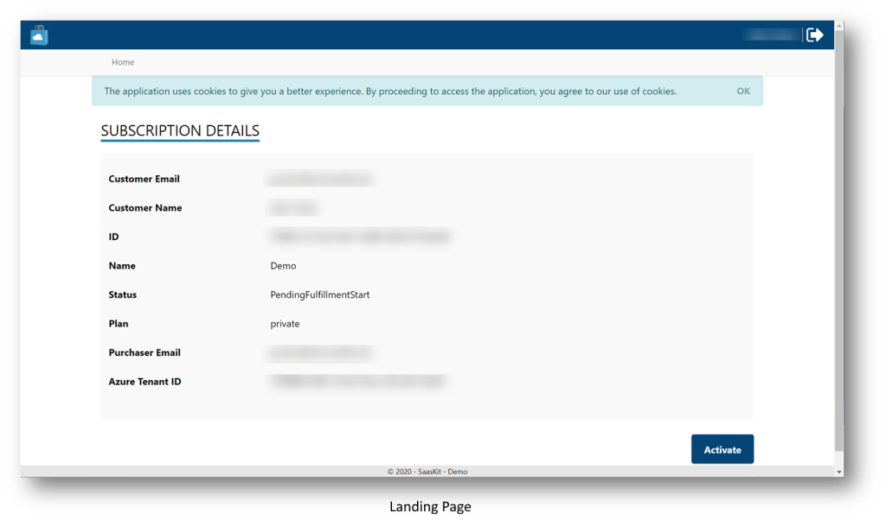
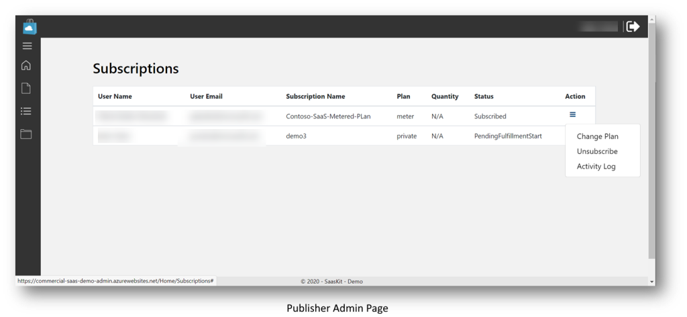

#  Microsoft Commercial Marketplace | Samples Index 
This is a list of repositories of samples we find useful in understanding Microsoft Commercial Marketplace concepts. Please submit a pull request if there is a sample you have developed, or find that you think that may benefit the community by adding a section under the relevant offer type with a short description and a link to the sample repo.

Likewise, if there is a sample you wish existed, please add it to our [Issues](https://github.com/microsoft/commercial-marketplace-samples/issues).

If you are here, you may also be interested in Partner Center training. We have weekly office hours for business and development. Join us live or review a recording:
- [Business office hours](https://aka.ms/MarketplaceOfficeHours)
- [Developer office hours](https://aka.ms/MarketplaceDeveloperOfficeHours)

Check out the [online learning pages](./docs/learning-overview.md) suggested articles, videos, webinar recordings and more.

## SaaS offers

### Clients for Fulfillment and Metering APIs

We are using an Open API Specification (OAS) document (previously known as Swagger) for generating open source community API clients targeting different programming languages. Currently the following are available (all in preview).

There are packages for some client libraries as personal efforts for convenience, published at the appropriate package repositories. They are listed below. They are unsupported and personal.

- OAS document for Fulfillment API v2 and Metering service API, https://github.com/microsoft/commercial-marketplace-openapi 
- Client library for .NET, https://github.com/microsoft/commercial-marketplace-client-dotnet, [NuGet](https://www.nuget.org/packages/Marketplace.SaaS.Client)
- Client library for Java, https://github.com/microsoft/commercial-marketplace-client-java
- Client library for Python, https://github.com/microsoft/commercial-marketplace-client-python, [PyPi](https://pypi.org/project/azuremarketplace/)
- Client library for Node.js, https://github.com/microsoft/commercial-marketplace-client-node, [NPMJS- Metering](https://www.npmjs.com/package/microsoft.marketplace.metering), [NPMJS- SaaS](https://www.npmjs.com/package/microsoft.marketplace.saas)
- Client library for Go (coming soon), https://github.com/microsoft/commercial-marketplace-client-go

### Sample for customer registration, provisioning and subscription management (a.k.a. Microsoft Commercial Marketplace transactable SaaS offer SDK)

The sample code provides a framework for excercising the commercial marketplace billing system, including the SaaS Fulfillment API (v2) and Marketplace Metering Service API. This sample code demonstrates how a typical SaaS platform interacts with the marketplace APIs in order to provision subscriptions for customers, enable logging, and manage commercial marketplace subscriptions. It provides both a customer registration experience and a web interface for the publisher to manage the customer subscriptions.

[GitHub repo](https://github.com/Azure/Microsoft-commercial-marketplace-transactable-SaaS-offer-SDK)

## Azure application offers - Azure managed applications

### Custom metering, retrieving "resourceId" for a subscription

There are multiple approaches when a managed application needs to post usage to metering service. This set of notes and samples go through those approaches, and explain the relationship between them.

[GitHub repo](https://github.com/microsoft/commercial-marketplace-managed-application-metering-samples)

### Using a secret from the publisher's Azure Key Vault

There are scenarios when the publisher wants to share a secret during the deployment of a Managed Application. This sample demonstrates a technique sharing secrets during the deployment.

[GitHub repo](https://github.com/arsenvlad/azure-managed-app-publisher-secret)

## Azure application offers - Solution Template Offers

- [Overview](https://docs.microsoft.com/en-us/azure/marketplace/plan-azure-application-offer)
- [Azure QuickStart Templates](https://github.com/github/azure-quickstart-templates)
- [MS Build 2018 Presentation: Building Solution Templates and Managed Applications for the Azure Marketplace](https://channel9.msdn.com/Events/Build/2018/BRK3603)

## Azure virtual machine offers

This sample shows how to build a Virtual Machine for Linux or Windows and demonstrates the basic steps required to make the image ready for the Microsoft Commercial Marketplace.

[GitHub repo](https://github.com/microsoft/commerical-marketplace-vm-sample)

## Lead management integration samples

- [HubSpot Integration](https://github.com/santhoshb-msft/amp-leadgen2hubspot)

## Online learning resources

  [Online learning resources](./docs/learning-overview.md) are available to include key articles, webinars, videos and more.

## Community content

- [Building a Virtual Machine offer](https://microsoftcloudpartner.eventbuilder.com/event/38108): In this session, we will cover how to build and test a Virtual Machine offer for the Azure Marketplace. This includes pointers to example implementations of building images.
- [VM Content and Metadata Validation Process](https://microsoftcloudpartner.eventbuilder.com/event/39384): Becky Gaudet will explain how Azure Virtual Machine offer content and metadata validation works. She will focus on common issues seen by the validation team. She will also explain the process and highlight any recent changes to the VM validation process. 
- [Lab: Publish a VM Offer](https://www.azurecitadel.com/marketplace/vmoffer/): An end to end walkthrough of building a VM Offer from creating the technical assets to publishing in Partner Center.